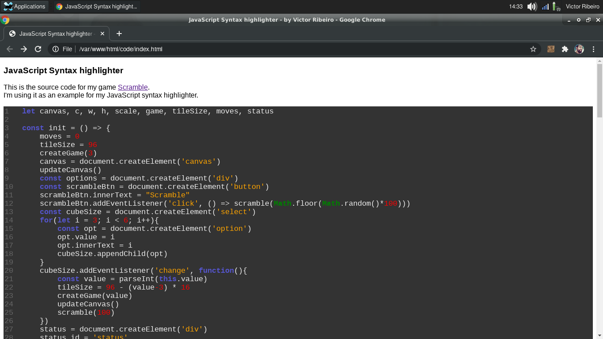

# JavaScript Syntax Highlighter



## About

A simple JavaScript syntax highlighter to be used when share code in a html page. Very easy to add new rules or to change the reserved words  or methods.

[Live Version](https://victorribeiro.com/syntax)

## How to use it

Add the file `syntax.min.js` to the end of your code and it will automatically highlight every `<code>` tag that you have in your page. Or use the defer attribute:

```html
<script src="syntax.min.js" defer></script>
```

The script will create `<spam>` tag for every reserved word, variable, methods and numbers so you can target them with CSS.

```css
code {
  font-family: Consolas,"courier new";
  color: #EEE;
  background-color: #333;
  padding: 2px;
  font-size: 105%;
  display: block;
  white-space: pre;
  counter-reset: line;
}

code > div {
  counter-increment: line;
  display: block;
  min-height: 1em;
}

code > div::before {
  content: counter(line) '\A0';
  display: inline-block;
  width: 4ch;
  text-align: left;
  -webkit-select: none;
  color: #666;
}

.reserved {
  font-weight: bold;
  color: #55C;
}

.methods {
  font-weight: bold;
  color: green;
}

.variable {
  color: orange;
}

.comment {
  color: gray;
}

.number {
  color: red;
}
```

Fell free to change anything you like to better suit your needs.
